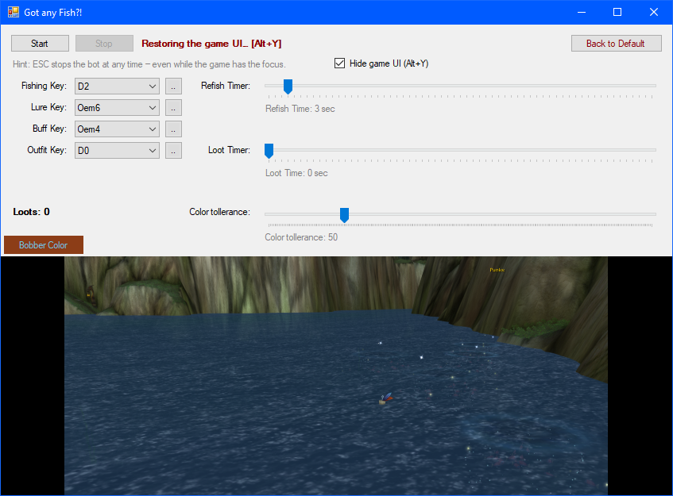

<div align="center">

# 🎣 DefinetlyNotAFishingBot

**Absolutely, positively, 100% not a fishing bot for World of Warcraft: Wrath of the Lich King (3.3.5a).**
*Please ignore all the fish it catches.*


-orange)

[](LICENSE)

**[⬇️ Download the latest release](https://github.com/derDere/DefinetlyNotAFishingBot/releases)** — no installer, no admin prompt. Unzip, double-click, fish.

**[🌐 Visit the website](https://derdere.github.io/DefinetlyNotAFishingBot/)** — this page, but with more Azeroth.



</div>

---

Fishing in WoW is a beloved pastime that consists of staring at water for hours and clicking a bobber before it stops bobbing. This program loves doing that *for* you. You set it up once, press **Start**, walk away, and come back to a bag full of fish and a fishing skill your guild will pretend not to be jealous of.

Built for **private servers where fishing bots are allowed**. If bots are not allowed where you play, don't use it there — see [Fair play](#-fair-play) below.

## What it actually does

Once your character stands at the water with a fishing pole ready, the bot runs this routine on repeat, all night if you let it:

1. **Gets dressed** — presses your outfit key to equip the fishing gear (optional).
2. **Applies a lure** to the pole and casts your buff (both optional), waiting patiently after each step like a well-behaved player.
3. **Casts** the fishing line.
4. **Finds the bobber** on screen and stares at it roughly 25–30 times per second — far more devotion than any human has ever given a bobber.
5. **Detects the bite** the moment the bobber dips and the splash swallows it.
6. **Right-clicks the bobber** to loot the fish.
7. Waits a moment (servers like a little breathing room), re-applies lure and buff when their ~10-minute timers run low, and casts again.

A live counter shows how many times it has looted this run, and a green rectangle in the preview shows exactly where it currently believes the bobber is — so you can check on it like a proud (or suspicious) parent.

## How it works — no dark magic

The bot plays the game exactly the way you would, just with infinite patience:

- 👀 **It looks at the screen.** You place a see-through overlay window (charmingly titled *"Where is the Fish?!"*) over the patch of water where your bobber lands. The bot only ever looks inside that frame.
- 🎨 **It finds the bobber by color.** You click the bobber's red feather once in the preview; from then on the bot searches for exactly that color in the water.
- ⌨️🖱️ **It presses keys and moves the mouse.** Regular keyboard and mouse input, the same kind Windows sends when you type — into the game window, which the bot makes sure is focused before every single key press.

That's the whole trick. It does **not** read the game's memory, does **not** inject anything into the game, and does **not** modify any game files. As far as your computer is concerned, it's just a program looking at the screen and typing — which is also exactly why it needs no special privileges:

## 🛡️ No administrator rights — really

**This bot never needs to run as administrator. Not to install (there is nothing to install), not to run, not ever.**

You never have to type a password, never have to click "Yes" on a scary UAC prompt, and never have to grant a random program from the internet control over your machine. It runs as a plain, unprivileged program — as it should.

The one rule that comes with this: **don't run WoW as administrator either.** Windows only lets a normal program send input to another normal program. If the game runs elevated, the bot's key presses bounce off it — that's a Windows security feature, not a bug. Just start WoW normally (that's the default anyway) and everything works.

## What you need

- 🪟 **Windows 10 or 11.** The required .NET Framework 4.8 is already part of both — nothing extra to install.
- 🎮 **A WoW 3.3.5a (Wrath of the Lich King) client** on a **private server where fishing bots are permitted.**
- 🎣 A character with a fishing pole and the Fishing skill, standing at some water.
- Five minutes for the one-time setup below.

## Quick start

### 1. One-time setup in WoW

- Play in **Windowed** or **Windowed (Maximized)** mode — the overlay can't sit on top of exclusive fullscreen.
- Turn on **Auto Loot** (Interface → Controls), so one right-click on the bobber grabs everything.
- Put **Fishing** on the action bar slot of your fishing key (default: `2`).
- Optional but recommended — a **lure macro** on your lure key:

  ```
  /use Bright Baubles
  /use 16
  ```

  Slot 16 means "main hand", i.e. the equipped pole. Any lure works, just swap the name.
- Optional: a buff (food, drink, whatever) on the buff key and an equip-my-fishing-gear macro on the outfit key. Anything you don't use, set its key to `None` in the bot — it will simply be skipped.
- Close the chat input and any open windows, and face your character toward the water.

### 2. One-time setup in the bot

1. **[Download the latest release](https://github.com/derDere/DefinetlyNotAFishingBot/releases)**, unzip it anywhere, and run `DefinetlyNotAFishingBot.exe`. Three windows appear: the settings window (*"Got any Fish?!"*), the overlay frame (*"Where is the Fish?!"*), and a console window that logs what the bot is doing (feel free to minimize it — see [The three windows](#the-three-windows)).
2. **Drag and resize the overlay** over the water where your bobber usually lands. The preview at the bottom of the settings window shows exactly what the bot sees. Keep the region reasonably tight (less water = faster and fewer mistakes) and aim for casts landing near its **middle**, not at an edge. The position is remembered for next time.
3. **Cast once manually**, then **click the bobber's red feather in the preview**. That picked color is what the bot will hunt for — it's saved for all future sessions.
4. Check the **Color tolerance** slider (somewhere around 25–40 is a good start). Too low and the bobber isn't found; too high and the bot starts seeing bobbers in plain water.

### 3. Fishing time

1. Press **Start**. The settings window politely minimizes itself if it's in the way of the overlay. The bot focuses the game and takes over — **hands off mouse and keyboard.**
2. Watch the overlay's frame color to see what it's doing: 🔴 **red** = bot off, 🔵 **blue** = fishing, 🟢 **green** = a bite! Looting!
3. **Press Escape to stop — anytime, anywhere.** It works even while the game has the focus, and the settings window pops back up. The Escape key is only claimed while the bot runs; afterwards it behaves completely normally again.
4. Want to look something up on Wowhead or chat on Discord? Just **alt-tab or click any other window** — the bot pauses instantly and waits. Click back into WoW and it resumes as if nothing happened.

## The three windows

| Window | What it is |
|---|---|
| **"Got any Fish?!"** | The settings window (the screenshot above). Start/Stop, key bindings, timers, color tolerance, the loot counter, and the live preview with a green marker on the detected bobber. The status text is colored too: green = running, yellow = paused, red = stopped. |
| **"Where is the Fish?!"** | The overlay frame you place over the water. Its interior is a hole — you see (and the bot clicks) straight through it into the game. Its frame color shows the bot's current phase. |
| **The console** | A timestamped log of everything the bot does — every cast, every bite, every fish. Nice for checking what happened while you were gone; safe to minimize and ignore. (For terminal folks: it also accepts `start`, `stop`, `status` and `quit` on standard input.) |

## Settings explained

- **Fishing / Lure / Buff / Outfit Key** — the keys the bot presses for each action. Set them to whatever your action bars and macros use; set a key to `None` to skip that action entirely.
- **Refish Timer** — how long to wait after each attempt before casting again.
- **Loot Timer** — how long to hover over the bobber before right-clicking, giving the game a moment to register the mouse-over.
- **Color tolerance** — how far a pixel's color may stray from your picked bobber color and still count as "bobber".
- **Hide game UI (Alt+Y)** — when checked, the bot hides the game interface while it runs (and restores it on stop), so no window or button can cover the bobber. Uncheck it if you'd rather keep your UI on screen.
- **Back to Default** — resets everything, in case the tinkering got out of hand.

Everything — including the picked bobber color and the overlay position — is saved automatically to a small file at `%USERPROFILE%\.definetly_not_a_fishing_bot_config.json`. There is no "Save" button because there is nothing to remember to do.

## FAQ & Troubleshooting

**Is this safe for my account?**
On a private server that allows fishing bots: that's exactly what it's built for. It touches nothing but your screen and your keyboard/mouse — no memory reading, no injection, no modified game files. On servers where bots are forbidden, no technique makes botting "safe" — so don't (see [Fair play](#-fair-play)).

**It says "Bobber not found — recasting…" every single time.**
Raise the color tolerance, re-pick the color from a fresh cast, make the overlay region smaller, or turn the camera so the water fills the region without reddish clutter (terrain, campfires, that one guy in red armor) behind it.

**It misses the bobber on some casts only.**
The bobber sometimes lands outside your overlay region. Enlarge the region or re-aim it so casts land near its middle. The bot recovers by recasting — it just costs time.

**It clicks, but nothing gets looted.**
Turn on Auto Loot, and make sure the overlay really covers the spot where the bobber floats so the click lands on it.

**It "catches" fish that were never there (clicks without a splash).**
Lower the color tolerance, and avoid regions with moving backgrounds — waterfalls, fountains, other players' pets doing zoomies.

**The status says "Color matches too much water".**
The picked color and tolerance match half the lake, so the bot refuses to click at random. Lower the tolerance or pick a more distinct spot of the bobber (the red feather works best).

**Key presses don't seem to reach the game.**
The game must not be running as administrator (see [above](#-no-administrator-rights---really)). Windows display scaling is safest at 100%.

**"WoW window not found".**
Start the game before pressing Start. The bot looks for the 3.3.5a client window specifically.

**Does it work with retail / Classic / other versions?**
No. It's built for the 3.3.5a (WotLK) client. Other clients have different windows, different bobbers, and — on official servers — very different opinions about bots.

## 🐧 Linux?

The bot is **made for Windows** — that's where it's built, tested, and used. Since it's a plain .NET Framework application, it *might* run on Linux under [Mono](https://www.mono-project.com/) — but nobody has promised that, nobody has tested it, and screen capture plus input synthesis are exactly the kind of things that get adventurous under Mono. If you want to try it: go ahead, tinker, you're on your own, and we salute you. 🫡

## ⚖️ Fair play

This tool exists for **private servers where fishing bots are explicitly permitted**. Using any bot on official servers, or on private servers that forbid botting, violates their rules and typically ends in a ban — the bot being "just pixels and key presses" does not change that. Where you run it, and whether the rules there allow it, is entirely your responsibility.

## 🛠️ For the nerds: building from source

Classic .NET Framework 4.8 WinForms solution; Newtonsoft.Json is the only dependency.

```
nuget restore DefinetlyNotAFishingBot.sln
msbuild DefinetlyNotAFishingBot.sln
```

Output: `DefinetlyNotAFishingBot\bin\Debug\DefinetlyNotAFishingBot.exe`. The executable doubles as a console application: it logs every action with a timestamp and accepts `start | stop | status | quit` on stdin, so it can be driven from a terminal or a script without touching the GUI.

Technical details worth knowing: the bobber search matches pixels by per-channel color tolerance **plus** a red-dominance requirement relative to the picked color (that's what separates a red feather from brown water); the bite is detected when the matching pixel count collapses into the splash or the bobber's center visibly dips, confirmed over two consecutive samples; and the watch loop only captures the small region around the bobber, which is what makes ~30 scans per second possible. Input goes out via `SendInput` with scan codes, and the bot verifies the game has focus immediately before every key press and click.

## 📜 License

Free software, released under the [GNU General Public License v3.0](LICENSE): use it, study it, share it, improve it — as long as it stays just as free.
